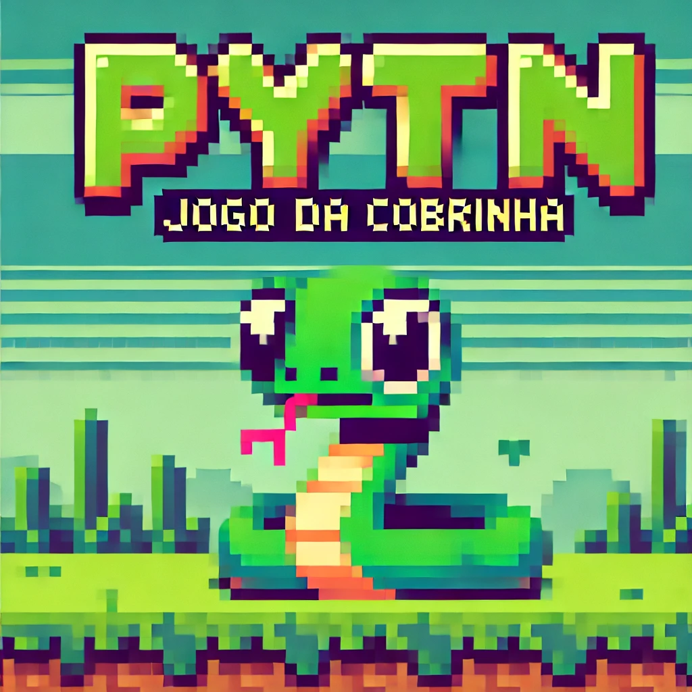

# Pytn - Jogo da Cobrinha 🐍



Este repositório contém dois jogos simples da cobrinha escritos em Python: 

- **`pytn.py`**: Versão básica do jogo onde o jogador controla a cobra `Pytn` para apanhar uma única fruta.
- **`pytn-advanced.py`**: Versão avançada onde o jogador precisa apanhar 3 frutas e o tempo de jogo é registado num **Leaderboard** local.

## 🚀 Como Jogar
1. Certifica-te de que tens **Python 3** instalado.
2. Faz o download do repositório ou clona-o com:
   ```bash
   git clone https://github.com/teu-usuario/workshop-pytn.git
   ```
3. Navega até à pasta do projeto:
   ```bash
   cd workshop-pytn
   ```
4. Corre um dos jogos:
   ```bash
   python pytn.py
   ```
   ou para a versão avançada:
   ```bash
   python pytn-advanced.py
   ```
5. Move a cobra usando as teclas:
   - `w` → Cima
   - `s` → Baixo
   - `a` → Esquerda
   - `d` → Direita
6. Diverte-te e tenta bater o recorde no **Leaderboard**! 🏆

### Opção 2: Correr Online (Sem Instalação)
Se preferires correr o jogo sem instalar nada, usa o **[OnlineGDB](https://www.onlinegdb.com/online_python_compiler)**.

## 🏅 Leaderboard (Versão Advanced)
- **O jogo regista o nome do jogador e o tempo total.**
- **Apenas os 5 melhores tempos são guardados** no ficheiro `leaderboard.txt`.
- O ficheiro **não é incluído no repositório** (`.gitignore` já está configurado para ignorá-lo).

## 📜 Licença
Este projeto está sob a licença **MIT**. Sente-te à vontade para modificar e partilhar!

## 📧 Contribuições
Se tiveres sugestões ou melhorias, abre um **Pull Request** ou entra em contacto!

🐍 Divirtam-se a aprender Python com o **Pytn**! 🚀

